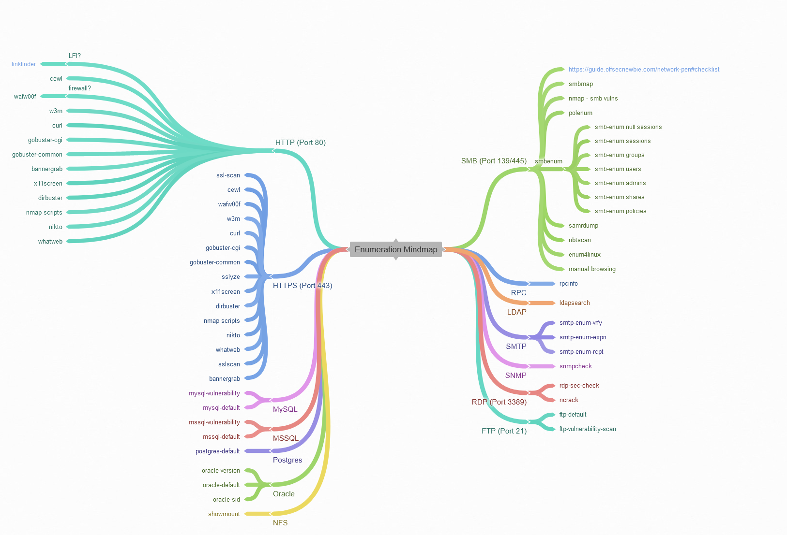

# Mindmap


**The best way to engage a challenge is always to define a process or the tools and respective techniques that will quickly get us some low hanging fruit and move from there into something more complex.**


## The mindmap concept

_A mind map is a diagram used to visually organize information in a hierarchy, showing relationships among pieces of the whole. It is often created around a single concept, drawn as an image in the center of a blank page, to which associated representations of ideas such as images, words and parts of words are added. - \<Wikipedia>_

Ok, cool now tell me how can we utilize it for offensive security? Pretty simple, we need to define what techniques and tools we have for the most important part the Enumeration.

I would express that Enumeration is critical for success and to not get stuck in a challenge or even on a real world acessment.

### An example mindmap

