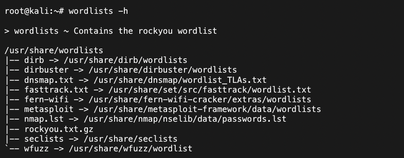

# Bruteforcing


Keep your wordlists clean, make sure in case you download additional wordlists to keep them in /usr/share/wordlists/ in your Kali machine.


**Wordlists**

SecLists - [https://github.com/danielmiessler/SecLists](https://github.com/danielmiessler/SecLists)

Dirsearch - [https://github.com/maurosoria/dirsearch/blob/master/db/dicc.txt](https://github.com/maurosoria/dirsearch/blob/master/db/dicc.txt)

Assetnote - [https://wordlists.assetnote.io/](https://wordlists.assetnote.io/)

```
// For removing duplications in wordlist 
cat wordlist.txt| sort | uniq > new_word.txt
```

By default Kali should already ship with the following wordlists:



### Directory Bruteforce&#x20;

**Cewl**

```
cewl -d 2 -m 5 -w docswords.txt http://10.10.10.10 ​ 

-d depth 
-m minimum word length 
-w output file 
--lowercase lowercase all parsed words (optional)
```

### **Password / Hash Bruteforce**&#x20;

**Hashcat**

To know which m parameter to set (-m) ​ - [https://hashcat.net/wiki/doku.php?id=hashcat](https://hashcat.net/wiki/doku.php?id=hashcat)

To identify the hash (hashid) - [https://mattw.io/hashID/types](https://mattw.io/hashID/types)

```
hashcat -m 0 'hash$' /usr/share/wordlists/rockyou.txt // MD5 raw
hashcat -m 1800 'hash$' /usr/share/wordlists/rockyou.txt // sha512crypt
hashcat -m 1600 'hash$' /usr/share/wordlists/rockyou.txt // MD5(APR)
hashcat -m 1500 'hash$' /usr/share/wordlists/rockyou.txt // DES(Unix), Traditional DES, DEScrypt 
hashcat -m 500 'hash$' /usr/share/wordlists/rockyou.txt // MD5crypt, MD5 (Unix)
hashcat -m 400 'hash$' /usr/share/wordlists/rockyou.txt // Wordpress
```

**John (JTR)**

```
john hashfile --wordlist=/usr/share/wordlists/rockyou.txt --format=raw-md5
```

### Protocols Bruteforce

**Hydra**

`TELNET, FTP, HTTP, HTTPS, HTTP-PROXY, SMB, SMBNT, MS-SQL, MYSQL, REXEC, irc, RSH, RLOGIN, CVS, SNMP, SMTP, SOCKS5, VNC, POP3, IMAP, NNTP, PCNFS, XMPP, ICQ, SAP/R3, LDAP2, LDAP3, Postgres, Teamspeak, Cisco auth, Cisco enable, AFP, Subversion/SVN, Firebird, LDAP2, Cisco AAA`

**Medusa**

`AFP, CVS, FTP, HTTP, IMAP, MS-SQL, MySQL, NetWare NCP, NNTP, PcAnywhere, POP3, PostgreSQL, REXEC, RLOGIN, RSH, SMBNT, SMTP-AUTH, SMTP-VRFY, SNMP, SSHv2, Subversion (SVN), Telnet, VMware Authentication Daemon (vmauthd), VNC, Generic Wrapper, Web Form`

**Ncrak (faster)**

`RDP, SSH, http(s), SMB, pop3(s), VNC, FTP, telnet`

**SSH**&#x20;

```
ncrack -v -U user.txt -P pass.txt ssh://10.10.10.10: -T5 
hydra -L users.txt -P pass.txt 192.168.0.114 ssh 
```

**SMB**

```
ncrack -u qiu -P /usr/share/wordlists/rockyou.txt -T 5 192.168.0.116 -p smb -v
```

**HTTP-Post**&#x20;

```
hydra -L users.txt -P rockyou.txt 10.10.10.10 http-post-form "/login.php:user=^USER^&pass=^PASS^:Invalid Username or Password" -V -s 7654
```
